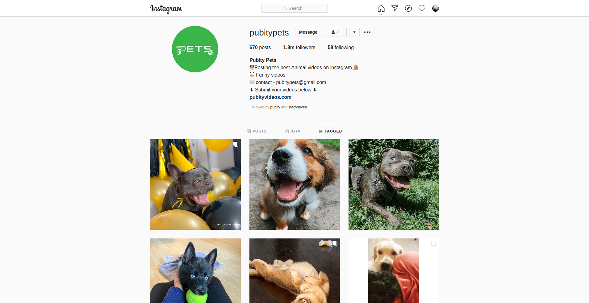

# Project "Instagram mock-up"

## **Disclaimer**: 
1. This was an exercise from **DCI's WEB Development Course**, which I attended between 2019 - 2021. 
2. This project is just for learning purpose. 

#### The mainly tasks were: 
- [x] Build your own **data.json** which contains all the information about posts;
- [x] Use **Sass** for this build;
- [x] Feel free to have any other artist or celebrity or even your own photos;
- [x] Consider that you have to use **props** and pass data to components;

### New Project Roadmap
*I've decided to seize the opportunity and add more features to this Project, therefore the new ROADMAP for this project is the follow*.

#### Frontend
- [x] Lookalike Instagram Layout
- [x] React router system, with react-router-dom
- [x] Show stats on Hover.
- [x] Breaking code into small components.
- [x] Working with Fontawesome and Emojis on React
- [x] Axios and API instead local data.json
- [x] Infinite scrooling using react-infinite-scroll-component
- [ ] Authentication with Firebase
- [ ] User Profile
- [ ] Mobile Layout

#### Backend
- [ ] REST API using Node.js / Store data in MongoDB

## Model

## Available Scripts

In the project directory, you can run:

### `npm start`

Runs the app in the development mode. 
Open [http://localhost:3000](http://localhost:3000) to view it in the browser.

### `npm run build`

Builds the app for production to the `build` folder. 

### 🚀 Technologies used

